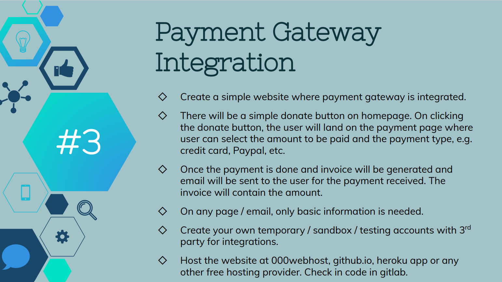

# Payment-Gateway

Gracious Givers Charitable Trust is a website designed using HTML, CSS, and JavaScript, developed for donating money to children in need of education all over India. This has been developed as part of the Graduate Rotational Internship Program (GRIP) conducted by The Sparks Foundation, where I interned as a Web Development and Design intern.

The payment gateway that has been used is Razorpay.

The given task - 

